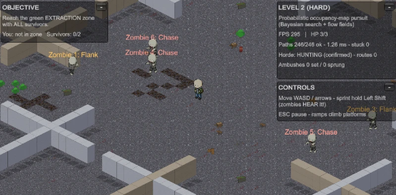
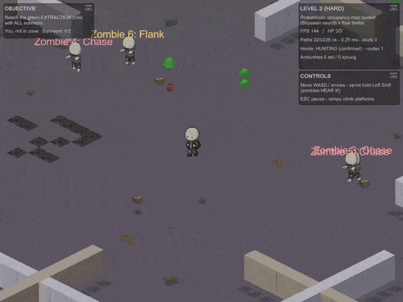
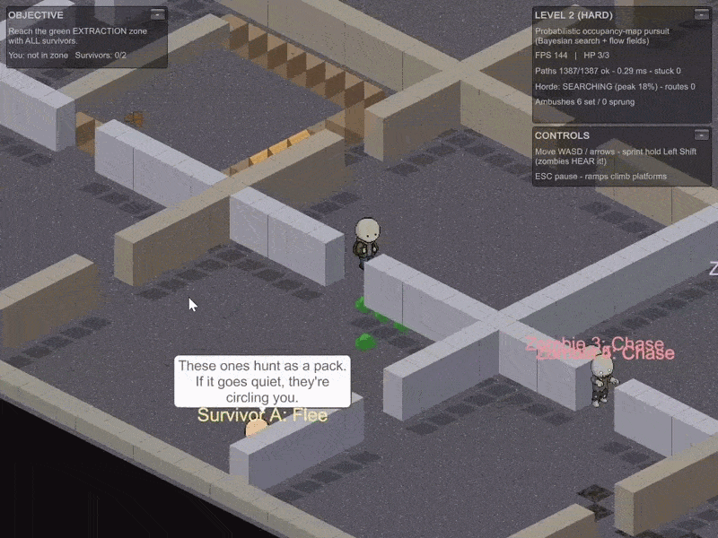

# Zombie Nav Demo

An isometric Unity prototype that implements two different pursuit AIs against the same player
and the same navigation graph: Level 1 hunts you with independent A* replanning, Level 2 hunts
you with a coordinated horde that maintains a probability distribution over where you might be
and searches it.

**Hiding works, because the horde is tracking a belief rather than you.**

The top-right info panel — its title bar reads `LEVEL 2 (HARD)` — starts on `Horde: HUNTING
(confirmed)`: a zombie has eyes on the player, so the belief has collapsed to a single cell.
Breaking line of sight drops the confirmation and the panel switches to `SEARCHING (peak 35%)`:
the horde no longer knows where the player is and is working a probability distribution instead.
Level 1 cannot do this — it reads the player's true position for as long as it has sight.

**Ambushers pre-position on the routes the player keeps using.**

`Ambushes 6 set` with `Zombie 1: Ambush` holding position. While the target is unconfirmed the
director sends spare zombies to the chokepoints nearest the hottest cells of a decaying visit
heatmap — guarding where the player has been going rather than chasing where they are. The clip
ends with `Horde: calm` as the belief mass falls below its threshold and the search is called off.

<!-- Not captured yet, both optional:
     - an ambush actually springing ("Ambushes N set / M sprung" incrementing). Build the heatmap
       by walking a route until `routes` climbs, break line of sight, then walk back along it.
     - level1-astar.gif — the Level 1 control condition: a zombie spotting you, the scream pulling
       a second into Investigate. Lower value; the comparison is already made above.
     Format to match: 800x600, 8fps, ezgif lossy ~75, under 8 MB. -->

## Start here

If you have two minutes:

1. **Read [`HordeDirector.cs`](Assets/Scripts/NpcDemo/HordeDirector.cs) first.** `UpdateBelief`
   is the whole idea in one method — collapse the distribution on a sighting, diffuse it
   otherwise, cull every cell a zombie can currently see and does *not* find you in, normalize.
   The roles, the search peaks and the ambush layer are all allocation on top of that one grid.
2. **Then [`IsoNavGrid.cs`](Assets/Scripts/NpcDemo/IsoNavGrid.cs).** The substrate both levels
   share: `FindPath` (A\*), `ComputeFlowField` (one BFS field the whole horde steps along), and
   `ComputeChokepoints`, which is what makes the ambush layer possible at all.
3. **If you only run it once, play Level 2.**
   [Download the Windows build](https://github.com/jdseo921/zombie-nav-demo/releases/latest) —
   no Unity needed. Let a zombie see you, then break line of sight and hide. Watch the info
   panel switch from `HUNTING (confirmed)` to `SEARCHING (peak N%)` and the percentage fall as
   the searchers sweep. That is the belief model working, and it is the one thing Level 1
   cannot do.

## What this demonstrates

- **Heightmap navigation graph with A\* pathfinding.** One walkable floor per column with a
  float height; ramps sit at `level + 0.5` and steps are gated purely by height difference
  (`MaxStep = 0.6`), so a placed ramp is always climbable and a cliff is always blocked
  independently of colliders — [`IsoNavGrid.cs`](Assets/Scripts/NpcDemo/IsoNavGrid.cs).
- **A\* pops from a binary heap.** `FindPathInternal` previously picked the lowest-`f` node by
  scanning a `List<Vector2Int>` and called `open.Contains` for each neighbour — both O(n) on
  every expansion, worst on the Level 2 maze where flankers path across a 120×120 grid. The
  open set is now a `PathHeap` ordered by `f` then insertion order, with stale entries skipped
  on pop rather than removed on improvement, which is sound because Manhattan distance on a
  4-connected uniform-cost grid is a consistent heuristic. The 40,000-iteration safety cap
  still counts expansions, not stale pops.
  <!-- TODO (jdseo921): insert the measured before/after mean path solve time here. The info
       panel reports it live; take Level 2 readings on the same route, list before and after.
       Do not estimate it. -->
- **Shared BFS flow field for many agents.** One distance field per planning tick serves the
  whole horde, so each zombie takes an O(1) step instead of running its own search —
  `ComputeFlowField` / `FlowNextStep` in [`IsoNavGrid.cs`](Assets/Scripts/NpcDemo/IsoNavGrid.cs).
- **Probabilistic occupancy-map target tracking.** A belief grid that diffuses, is culled by
  negative observations, and collapses on a confirmed sighting —
  [`HordeDirector.cs`](Assets/Scripts/NpcDemo/HordeDirector.cs).
- **Continuous grid collision with per-axis resolution.** A square footprint is tested against
  blocked columns one axis at a time, which produces wall sliding and makes it impossible to
  overlap a wall, cliff face or platform edge from any direction —
  [`GridBody.cs`](Assets/Scripts/NpcDemo/GridBody.cs).
- **Sensor model separating sight from hearing.** Bresenham line of sight over the column grid
  (`IsoNavGrid.HasLineOfSight`) gates vision, while a sprinting player is heard *through* walls
  within `hearingRange` — [`NpcController.cs`](Assets/Scripts/NpcDemo/NpcController.cs) and
  [`HordeZombieController.cs`](Assets/Scripts/NpcDemo/HordeZombieController.cs).
- **Deterministic isometric depth sorting.** Explicit `sortingOrder` computed from ground Y
  rather than relying on the camera transparency sort axis, which the URP 2D renderer can
  override — [`YSorter.cs`](Assets/Scripts/NpcDemo/YSorter.cs).
- **Editor-time level generation with validation and auto-repair.** The builder paints both
  arenas, rebuilds the nav grid, runs reachability probes against named objectives, and carves
  extra doorways when the maze generator produces an unreachable room —
  [`JayNpcDemoBuilder.cs`](Assets/Editor/JayNpcDemoBuilder.cs).

## AI architecture

Both levels share one navigation graph, one collision body and one sensor model. What changes is
*what the zombies are allowed to know* and *who decides where they go*.

### Level 1 — independent A* against a moving target

Each zombie in [`NpcController.cs`](Assets/Scripts/NpcDemo/NpcController.cs) is autonomous and
runs a small state machine: `Patrol → Investigate → Chase → Attack`, plus `Flee` and `Follow`
for civilians. A zombie sees the player within `sightRange` when line of sight is clear, and
hears a sprinting player through walls within `hearingRange`. On acquiring a target it runs A*
to the target's **true cell**, then replans whenever that target steps onto a new cell,
rate-limited to one search per `MinRepathInterval` (0.2s); a zombie investigating a heard noise
instead replans on the slower `RepathInterval` (0.5s). This is classical replanning against a
moving target (Hart, Nilsson & Raphael 1968; Ishida & Korf, *Moving Target Search*, 1991).

Two details make it read as a pack rather than three separate chasers. Entering a chase fires a
"scream" (`AlertNearbyZombies`) that pushes patrolling zombies within `alertRadius` into
`Investigate` on the target's cell. And on losing the trail a zombie walks to the last known
position before returning to patrol, rather than snapping back instantly.

The important limitation is deliberate: **a Level 1 zombie always reads the player's true
position once it has line of sight.** Breaking line of sight only starts a grace timer
(`loseSightGrace`).

### Level 2 — occupancy-grid belief, flow field, roles, ambush

[`HordeDirector.cs`](Assets/Scripts/NpcDemo/HordeDirector.cs) is a single central planner; the
zombies in [`HordeZombieController.cs`](Assets/Scripts/NpcDemo/HordeZombieController.cs) only
execute assigned roles. The director ticks every `repathInterval` (0.4s) and runs four layers.

**1. Belief over where the player is.** The director keeps a probability `belief[]` over every
walkable column. Each tick is one recursive-Bayes step:

- *Collapse.* If any zombie currently sees or hears the player (`TargetConfirmed` — a sighting
  within the last 0.6s), the belief collapses to a single cell with probability 1.
- *Diffusion.* Otherwise the mass spreads to walkable neighbours at `diffusionRate`, a
  random-walk motion model for a target the horde cannot see.
- *Culling by negative observation.* Any cell a zombie can currently see (within
  `sightCullRange`, with clear line of sight) is multiplied by `negativeObservation` (0.06).
  Looking somewhere and *not* finding the player is evidence, so sweeping zombies squeeze the
  probability mass.
- *Normalize.* If the total mass falls below `1e-6`, every plausible hiding place has been
  cleared and the horde stands down.

This is the occupancy-grid idea from robotics (Moravec & Elfes 1985; Elfes 1989) adapted to game
AI for probabilistic target tracking and search (Isla 2006; Isla, *Third Eye Crime*, AIIDE
2013). The consequence that matters for play: **while you are hidden the horde never reads your
true position — it hunts the belief**, so breaking line of sight genuinely works.

**2. Shared flow field.** Once the director picks a goal — your cell when confirmed, the belief
peak when not — it calls `nav.ComputeFlowField(target)` once. Every chasing zombie then reads
its next step straight off that field in O(1) instead of running its own A* (potential fields,
Khatib 1986; continuum crowd fields, Treuille, Cooper & Popović 2006).

**3. Role allocation.** The horde is sorted by flow distance to the goal, then split by
`flankerFraction` (0.5):

- *Target confirmed* — the nearest half take `Chase` and ride the flow field. The farthest half
  take `Flank` and A* to cut-off cells arranged in a ring (`encircleRadius`) around a predicted
  intercept point, computed from your current velocity times `interceptLeadSeconds`. This is
  pursuit role allocation (Hespanha, Kim & Sastry 1999; Vidal et al. 2002; graph pursuit,
  "cops and robbers", Nowakowski & Winkler 1983).
- *Target hidden* — the nearest half converge on the belief peak while the farthest half take
  `Search` and are spread across the secondary peaks (`CollectSearchPeaks`, spaced at least 10
  cells apart), so the horde sweeps several hypotheses at once instead of clumping on one.

**4. Habit-anticipatory ambush.** A decaying visit heatmap (decay 0.98 per 0.4s tick) records
where you actually walk, and the strongest cells become `hotspots`. The heatmap does two jobs.
It biases belief diffusion toward your habitual routes (`heatBias`), and it drives an ambush
layer: whenever the target is **not** confirmed — including while the horde is otherwise calm —
up to `maxAmbushers` zombies are sent to the nearest **chokepoint** to a hotspot and hold
position there. Chokepoints are computed statically from the navigation graph in
`IsoNavGrid.ComputeChokepoints`: a cell you can pass through along one axis where the
perpendicular clearance is at most 2 cells, which is to say doorways and tight corridors. An
ambusher approaches at patrol speed, then stands still until you come within
`ambushTriggerRange`; springing the trap counts as an observation and collapses the belief.

The source comment flags this fusion — online route learning (cf. Yannakakis & Togelius 2013),
static chokepoint topology, and pre-emptive role allocation — as the project's own extension:
the cited techniques react to where the target *is* or probably is, while this layer
pre-positions for where the target will *return*. Both counters are surfaced on the HUD as
"Ambushes N set / M sprung".

### What each level actually ships

|                     | Level 1                            | Level 2                                             |
| ------------------- | ---------------------------------- | --------------------------------------------------- |
| Arena               | open campus                        | maze                                                |
| Zombies             | 3 × `NpcController`                | 6 × `HordeZombieController` + `HordeDirector`        |
| Survivors to escort | 2                                  | 2                                                   |
| Pursuit             | independent A* to true position    | shared flow field toward the belief peak             |
| Does hiding work?   | no — grace timer only              | yes — the belief must be diffused and searched out   |

## Editor tooling

Three level-authoring tools live in [`Assets/Editor/`](Assets/Editor) and are editor-only
(`#if UNITY_EDITOR`), alongside [`BuildDemo.cs`](Assets/Editor/BuildDemo.cs) (the command-line
build entry point) and the [edit-mode tests](Assets/Editor/Tests/IsoNavGridTests.cs).

| File | Lines | Purpose |
| ---- | ----- | ------- |
| [`JayNpcDemoBuilder.cs`](Assets/Editor/JayNpcDemoBuilder.cs) | 2,021 | The one-click chain. Builds both arenas, spawns actors, wires the HUD and objective, saves the `Level1`/`Level2` prefabs into `Assets/Resources/NpcDemo/`, and creates the game scene. Also runs the post-build reachability validation and the maze auto-repair pass. |
| [`JayLargeCampusTilemapBuilder.cs`](Assets/Editor/JayLargeCampusTilemapBuilder.cs) | 1,399 | Large-scale campus generator (Canteen 168×96, Block E 112×96 cells) built on the reference isometric tiles. Its `SetupTileAssets()` is the first step the demo builder calls. |
| [`JayNpcSpriteImporter.cs`](Assets/Editor/JayNpcSpriteImporter.cs) | 386 | Turns the raw character sheets in `SpriteStaging/` into sliced sprites. Keys out a baked-in checkerboard by flood-filling from the image border (so enclosed light pixels such as eyes survive), detects each frame as a connected pixel island, groups islands into front and rear rows, and slices with bottom-centre pivots at a PPU chosen to make characters about 1.4 world units tall. |

Two menu entries are registered: **Tools > CP5030 > Setup NPC Demo Arena** (the chain above) and
**Tools > CP5030 > Build Windows Demo**. The large-campus builder and the sprite importer are
invoked programmatically from the arena chain.

A fourth file,
[`JayGeneratedCampusTilemapBuilder.cs`](Assets/Editor/JayGeneratedCampusTilemapBuilder.cs) (851
lines), is an earlier bounded generator (Canteen 42×24, Block E 28×24) kept as history: it has no
`[MenuItem]`, no caller, and nothing in the project references it.

You do not need to run the builder to play. Both level prefabs are committed.

## Opening and running

**To just play it:** download the Windows x64 build from
[Releases](https://github.com/jdseo921/zombie-nav-demo/releases/latest), unzip, and run
`Zombie Nav Demo.exe`. No Unity install needed.

**To open the project:**

1. Unity **6000.4.10f1** (`ProjectSettings/ProjectVersion.txt`, revision `feeafc12a938`).
2. Open the project folder in Unity Hub.
3. Open **`Assets/Scenes/NpcDemoGame.unity`** — the shell scene, and the only enabled scene in the
   build settings. It contains the `GameManager`, which draws the menu and instantiates the level
   prefabs from `Resources/NpcDemo/` at runtime.
4. Press Play, then choose Level 1 or Level 2 from the menu.

`NpcDemo.unity` is a working file rather than an entry point: a pre-built arena for editing in
isolation. It is listed in the build settings but disabled, so it does not ship.

**Objective:** reach the green extraction zone with **both** survivors. If the player dies, or
any survivor is killed, the level fails and offers a restart.

## Controls

The demo player and the shell poll `Keyboard.current` directly. These are the only key bindings
in the gameplay scripts.

| Input | Action | Source |
| ----- | ------ | ------ |
| `W` `A` `S` `D` or the arrow keys | Move | `DemoPlayerController.Update` |
| Hold `Left Shift` | Sprint — zombies hear this through walls | `DemoPlayerController.Update` |
| `Esc` | Pause and resume (Resume, Restart Level, Settings, Main Menu) | `GameManager.Update` |

**There are no debug hotkeys.** The three HUD panels — OBJECTIVE (top-left), the level info
panel and CONTROLS (top-right) — are collapsed and expanded with the on-screen `-` / `+` button
on each panel title bar (`DemoUI.PanelHeader`), using the mouse.

The info panel ([`NavMetricsHud.cs`](Assets/Scripts/NpcDemo/NavMetricsHud.cs)) is titled with the
level name rather than a fixed caption. It reports the level's algorithm label, frame rate, player
HP, A* paths succeeded versus requested, mean path solve time in milliseconds, and the
stuck-recovery count. On Level 2 it also shows the director's mode (`calm`, `HUNTING (confirmed)`
or `SEARCHING (peak N%)`), the number of learned routes, and the ambush counters. Each zombie
additionally carries a world-space label showing its current role, colour-coded per role.

Note that `Assets/Settings/InputSystem_Actions.inputactions` is the stock Unity input template,
left in place because the project references it in its settings. Nothing in the demo reads it —
the controls above are polled directly from `Keyboard.current`.

## Scope and status

This is a gameplay and AI prototype built for a university unit (CP5030), not a finished game.

**What is real** — the systems work. All of it runs, and it is the point of the project.

- The navigation graph.
- The collision body.
- Both pursuit architectures.
- The role allocation and belief model.
- The level generators.
- The win/fail loop.
- The navigation core is covered by tests. 16 edit-mode tests exercise
  [`IsoNavGrid`](Assets/Editor/Tests/IsoNavGridTests.cs) — walkability, the `MaxStep` height
  gating, A\*, chokepoint detection, line of sight and the flow field. That is the bound of the
  coverage: there are no play-mode tests, and neither pursuit architecture is covered end to end.

**What is placeholder** — nearly everything around them.

- Character sprites are AI-generated sheets processed by the importer.
- Environment art is built from course-supplied reference tiles.
- Tall props and units fall back to a generated placeholder sprite.
- There is no audio in the project at all — no music and no effects.
- Level content is two generated arenas rather than designed levels.
- The interface is Unity's immediate-mode `OnGUI` rather than a built UI.
- There is no save system.
- There is no progression.
- There is no combat beyond contact damage against three hit points.

## Known limitations and future work

- **The belief update is a full grid sweep on the main thread.** `UpdateBelief` walks every
  column three times per planning tick — diffuse, cull, normalize — and the cull step tests each
  surviving cell against every zombie. It is bounded by `repathInterval` (0.4s) rather than by
  cost. A sparse representation over the cells with non-zero mass, or moving the sweep off the
  main thread, would scale better with map size and horde count.
- **Movement and line of sight are 4-connected.** Pathfinding, the flow field and chokepoint
  detection all use cardinal neighbours only, so routes show visible right-angle staircases on
  open ground. Path smoothing, or 8-connected steps with corner rules, would address it.
- **Ambush allocation is greedy and unvalidated.** `AllocateAmbushers` takes hotspots in heat
  order, accepts the first chokepoint found on an expanding ring search, and only requires that
  posts be 8 cells apart. It never checks that a post actually covers the route the heat came
  from, so an ambusher can end up guarding a doorway you have no reason to use.

## License

[MIT](LICENSE) for the code. Third-party and placeholder art assets are excluded — see the
LICENSE file.
